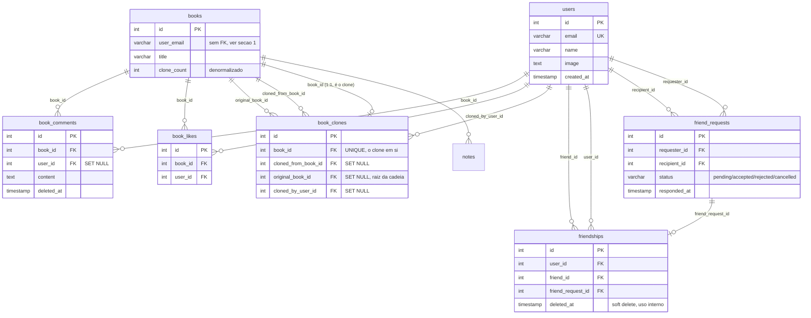

# Schema de Banco de Dados — Features Sociais

> Resolve a Issue #12. Alinhado com as decisões de `PRIVACY_MODEL.md`
> (Issue #11). SQL executável em `scripts/migrate.mjs`; cópia versionada
> em `docs/schema.sql`.

## 1. Decisões de design que fecham as questões em aberto da issue

- **IDs inteiros (`SERIAL`), não UUID.** A issue original sugeria UUID,
  mas `books` e `notes` já usam `SERIAL`. Manter o mesmo padrão evita
  misturar dois estilos de PK no mesmo banco sem nenhum ganho prático
  para o tamanho atual do projeto.
- **`books` e `notes` não são alterados na ownership.** Hoje `books`
  identifica o dono por `user_email` (string), sem FK para uma tabela de
  usuários — porque essa tabela não existe. As novas tabelas sociais
  referenciam `users(id)`; o vínculo entre um livro e seu dono como
  `users` continua sendo feito por `users.email = books.user_email` nas
  queries, em vez de migrar a coluna de ownership existente. Migrar
  `books.user_email` para uma FK `user_id` é uma mudança maior, arriscada
  em dado de produção já populado, e não é necessária para nenhuma das
  tabelas novas funcionar — fica registrada como possível follow-up, não
  como parte desta issue.
- **`friendships` usa o modelo normalizado (opção B do rascunho da
  issue):** duas linhas por amizade (`user_id=A,friend_id=B` e
  `user_id=B,friend_id=A`), mantidas atomicamente pela aplicação. Essa
  rede social é dominada por leitura ("meus amigos" é consultado a cada
  carregamento de várias telas) — o modelo normalizado deixa essa query
  um único `WHERE user_id = $1 AND deleted_at IS NULL`, sem `OR`, sem
  `UNION`, ao custo de gravar duas linhas em vez de uma no aceite/desfazer.
- **`friend_requests` usa `status`, não `deleted_at`, para o ciclo de
  vida.** O enum (`pending/accepted/rejected/cancelled`) já modela o
  histórico; adicionar soft delete por cima seria redundante. Pedidos
  nunca são apagados fisicamente — viram histórico consultável.
- **`friendships.deleted_at` (soft delete) existe**, mas só para suportar
  regras internas (ex: uma futura checagem de "não recriar amizade
  imediatamente" ou auditoria) — **não é exposto na UI** (`PRIVACY_MODEL.md`
  §5 já deixa isso explícito: não existe "vocês foram amigos até tal
  data" como feature visível).
- **Contagem de clones é denormalizada** em `books.clone_count`, mantida
  pela aplicação na mesma transação que insere em `book_clones` (`UPDATE
  books SET clone_count = clone_count + 1 WHERE id = $1`), em vez de
  trigger de banco. Justificativa: nenhuma outra parte do schema usa
  triggers, e manter a lógica em texto explícito na server action (como
  o resto do projeto já faz) é mais simples de auditar do que uma trigger
  "invisível" para quem só olha os `actions/*.ts`.
- **`book_comments`/`book_likes` não têm coluna de privacidade própria.**
  Visibilidade é sempre derivada de "sou amigo do dono do livro?" — não
  existe comentário/curtida "mais privado que o livro em si" (decisão já
  tomada em `PRIVACY_MODEL.md` §2).

## 2. Cascades — o que acontece quando um usuário é deletado

Segue diretamente `PRIVACY_MODEL.md` §6:

| Tabela | Coluna FK → `users(id)` | Regra | Por quê |
|---|---|---|---|
| `friend_requests` | `requester_id`, `recipient_id` | `CASCADE` | Pedido pendente não tem sentido sem as duas partes |
| `friendships` | `user_id`, `friend_id` | `CASCADE` | Amizade não sobrevive à conta de um dos lados |
| `book_likes` | `user_id` | `CASCADE` | Curtida "anônima" não faz sentido — melhor remover e decrementar |
| `book_comments` | `user_id` | `SET NULL` | Texto do comentário persiste; autor vira "Usuário removido" |
| `book_clones` | `cloned_by_user_id` | `SET NULL` | O livro clonado (linha em `books`) sobrevive; só perde o rastro de quem clonou |

E para `books(id)` como alvo de FK (dentro de `book_clones`):

| Coluna | Regra | Por quê |
|---|---|---|
| `book_clones.book_id` | `CASCADE` | Se o livro-clone em si é apagado, o registro de clone não tem mais objeto |
| `book_clones.cloned_from_book_id` | `SET NULL` | Livro original apagado não deve apagar os clones (requisito explícito da Issue #10) |
| `book_clones.original_book_id` | `SET NULL` | Mesma lógica, para a raiz da cadeia |

`books` e `notes` continuam com as regras já existentes (`notes.book_id
ON DELETE CASCADE`; `books` sem FK de saída).

## 3. Soft delete vs. hard delete, por tabela

| Tabela | Estratégia | Campo |
|---|---|---|
| `users` | Hard delete | — |
| `friend_requests` | Nunca deletado; ciclo de vida via `status` | `status` |
| `friendships` | Soft delete (uso interno, não exposto) | `deleted_at` |
| `book_clones` | Nunca deletado (histórico imutável da cadeia) | — |
| `book_likes` | Hard delete (é um toggle: descurtir = apagar a linha) | — |
| `book_comments` | Soft delete | `deleted_at` |

Queries em tabelas com soft delete sempre filtram `WHERE deleted_at IS
NULL` por padrão — mesma convenção usada nas duas tabelas que têm o
campo.

## 4. Diagrama ER

## 5. Índices

Já embutidos no DDL (`docs/schema.sql` / `scripts/migrate.mjs`); resumo
do porquê de cada um:

- `friend_requests(recipient_id, status)` — tela "pedidos recebidos".
- `friend_requests(requester_id, status)` — tela "pedidos que enviei".
- `friendships(user_id, deleted_at)` / `(friend_id, deleted_at)` —
  listagem de amigos ativos a partir de qualquer um dos dois lados.
- `book_clones(cloned_from_book_id)` — "quem clonou este livro".
- `book_clones(original_book_id)` — reconstruir a cadeia completa.
- `book_clones(cloned_by_user_id)` — "livros que eu clonei".
- `book_likes(book_id)` / `book_comments(book_id, deleted_at)` —
  carregar a página de detalhe do livro.
- `book_likes(user_id)` / `book_comments(user_id)` — atividade do
  usuário (usada pela Issue #13).

## 6. Constraints de integridade

- `friend_requests`: `CHECK (requester_id <> recipient_id)` (não dá pra
  pedir amizade a si mesmo) + `UNIQUE (requester_id, recipient_id)`
  (bloqueia duplicata na mesma direção). Duplicata na direção oposta (B
  já pediu para A enquanto A pede para B) **não é bloqueada pelo banco**
  — é uma regra de negócio para a camada de autorização (Issue #14)
  checar as duas direções antes de inserir, porque um `UNIQUE` simétrico
  exigiria normalizar `LEAST/GREATEST(requester_id, recipient_id)`, o
  que quebraria a semântica de "quem pediu para quem" que a tela precisa
  exibir.
- `friendships`: `CHECK (user_id <> friend_id)` + `UNIQUE (user_id,
  friend_id)`.
- `book_clones.book_id`: `UNIQUE` — um livro só pode ser clone de uma
  origem (não faz sentido um livro ser "clone duplo").
- `book_likes`: `UNIQUE (book_id, user_id)` — um usuário cur­te um livro
  uma vez só (curtir de novo é idempotente/no-op na aplicação).

## 7. Performance e escalabilidade

- **Volume esperado é baixo** (app pessoal/social pequeno) — os índices
  acima já cobrem os padrões de acesso previstos; não há necessidade de
  particionamento.
- **Contagem de clones denormalizada** (`books.clone_count`) evita
  `COUNT(*)` a cada carregamento da página de detalhe do livro — é o
  único ponto do schema com essa preocupação, porque é o único contador
  exibido em toda visita à página (curtidas/comentários já vêm com
  `LIMIT` + paginação, então um `COUNT` ali é aceitável se necessário no
  futuro).
- **Sem cache externo (Redis etc.) nesta v1** — os índices em Postgres
  são suficientes para o volume esperado; adicionar uma camada de cache
  sem medir gargalo real seria complexidade prematura.

## 8. O que fica para as próximas issues

- **Popular `users` no login** (upsert por email a partir da sessão do
  NextAuth) é implementação de aplicação, não de schema — fica para a
  Issue #9.
- **`authorize()`** (Issue #14) consome as tabelas `friendships` e
  `friend_requests` definidas aqui para decidir visibilidade.
- **Migração de `books.user_email` para `user_id`** — não incluída
  nesta issue (seção 1); se algum dia for necessária, é uma migration
  separada e cuidadosa sobre dado de produção existente.
